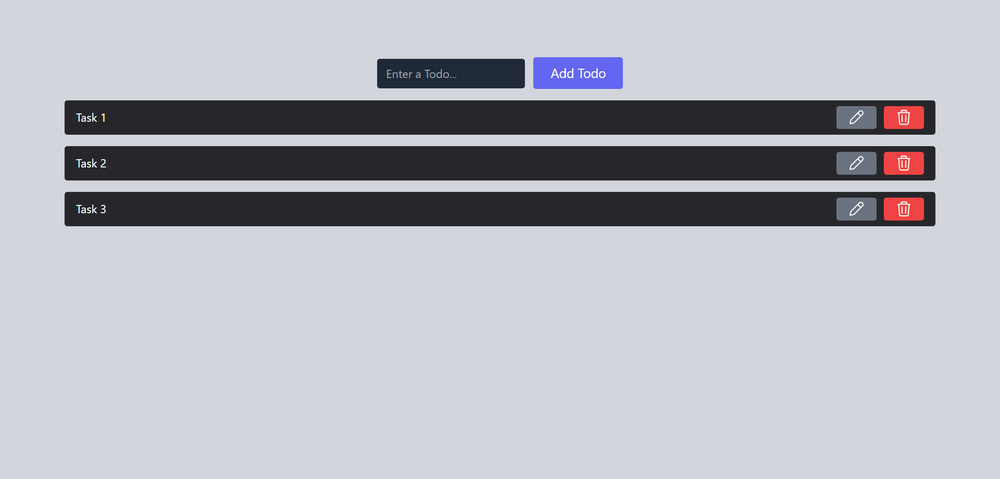

# To-Do List App - Redux Toolkit 
Hi, this repository contains a To-do List app built with ReactJS and Redux Toolkit. The app allows users to add, update, and delete tasks, offering an organized and efficient way to manage daily activities. This project showcases state management with Redux Toolkit and demonstrates the use of React hooks for handling local component states and effects.

Built with:

  

## Output:

